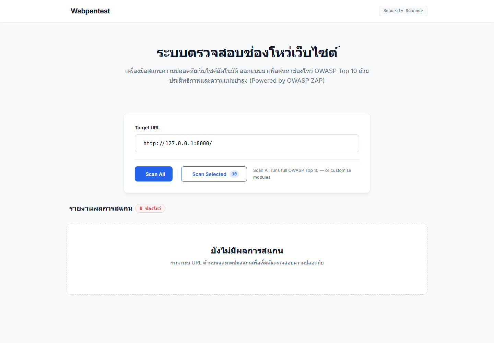
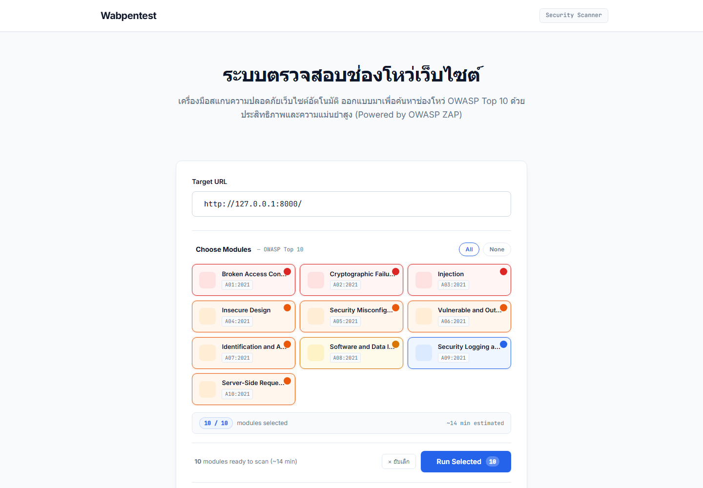
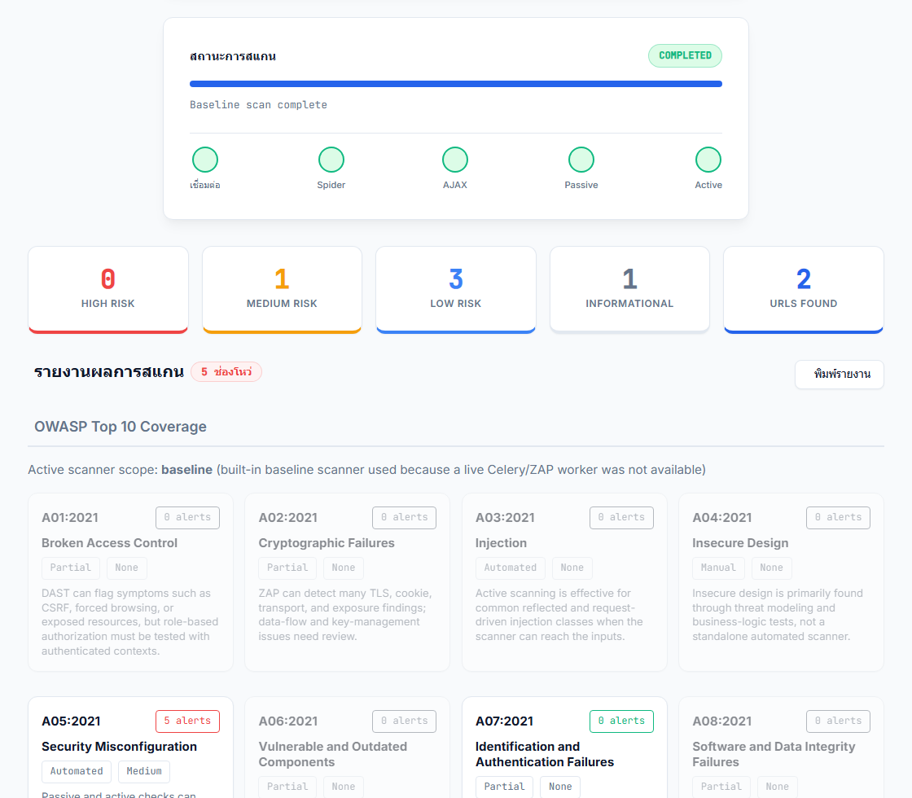
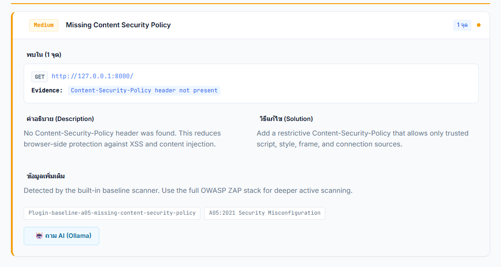
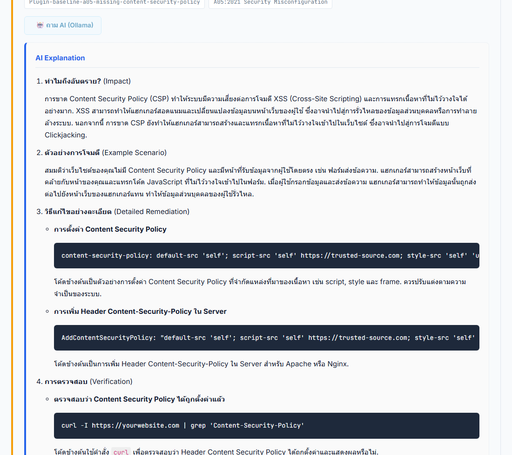

# Webpentest

## ระบบตรวจสอบช่องโหว่เว็บไซต์ พร้อม AI อธิบายผลแบบ Local LLM

  

    
โครงงานจบระดับปริญญาตรี

    <h3>แนวคิดของโครงงาน</h3>
    

      รวมการสแกนช่องโหว่เว็บ การจัดหมวดตาม OWASP Top 10 และ AI อธิบายผลภาษาไทยไว้ในระบบเดียว
      โดยใช้ AI local เพื่อลดความเสี่ยงข้อมูลหลุด
    

    

      

5

Findings

      

12

Tests OK

      

Local

AI Mode

      

A05

Main Risk

    

    
Penetration Tester | AI Developer / Engineer | Privacy by Default

    
วันที่จัดทำ: 10 มิถุนายน 2026

  

  

    
  

---
class: px-14 py-10
---

# ภาพรวม

## สรุปโครงงานใน 1 นาที

อธิบายปัญหา แนวทางแก้ และผลลัพธ์ให้กรรมการเข้าใจเร็ว

  

    <h3 class="text-rose-600">ปัญหา</h3>
    <ul>
      <li>ผลสแกนอ่านยากสำหรับผู้เริ่มต้น</li>
      <li>ต้องใช้หลายเครื่องมือแยกกัน</li>
      <li>การส่งข้อมูลให้ AI ภายนอกมีความเสี่ยง</li>
    </ul>
  

  

    <h3 class="text-blue-600">แนวทางแก้</h3>
    <ul>
      <li>Web UI สำหรับสแกนและดูรายงาน</li>
      <li>จัดหมวดตาม OWASP Top 10</li>
      <li>ใช้ Ollama local อธิบายผล</li>
    </ul>
  

  

    <h3 class="text-emerald-600">ผลลัพธ์</h3>
    <ul>
      <li>พบ finding จริง 5 รายการ</li>
      <li>Unit test ผ่าน 12 เคส</li>
      <li>มี screenshot และ JSON evidence</li>
    </ul>
  

ประโยคสรุป: Wabpentest ช่วยให้การตรวจช่องโหว่เบื้องต้นและการสื่อสารวิธีแก้ทำได้เร็วขึ้น โดยคำนึงถึงความปลอดภัยของข้อมูล

---
class: px-14 py-10
---

## หัวข้อการนำเสนอ

เรียงตามรูปแบบที่ใช้ส่งโครงงานจบ

  

01
<h3>บทนำ</h3>
ภาพรวมโครงงาน เป้าหมาย ขอบเขต และบทบาท

  

02
<h3>วิธีดำเนินโครงงาน</h3>
ขั้นตอนออกแบบ พัฒนา ทดสอบ และประเมินผล

  

03
<h3>ซอฟต์แวร์และอุปกรณ์</h3>
เทคโนโลยี เครื่องมือ และสภาพแวดล้อมที่ใช้

  

04
<h3>ความคืบหน้า</h3>
สิ่งที่เสร็จแล้ว พร้อมหลักฐานและผลทดสอบ

  

05
<h3>ชิ้นงาน</h3>
สาธิตหน้าจอจริง ผลสแกนจริง และ AI explanation

---
layout: center
class: text-center
---

# ส่วนที่ 1

## บทนำ

ภาพรวมของตัวโครงงาน

---
class: px-14 py-10
---

## ที่มาและความสำคัญ

ระบบเว็บต้องการทั้งการตรวจช่องโหว่และการอธิบายผลที่นำไปแก้ไขได้

  
<h3>ปัญหาที่พบ</h3><ul><li>ช่องโหว่มักเกิดจาก header, cookie, config และ input</li><li>ผลจาก scanner มีศัพท์เทคนิคจำนวนมาก</li><li>ผู้พัฒนาต้องแปลผลเองก่อนเริ่มแก้ไข</li></ul>

  
<h3>แนวคิดของระบบ</h3><ul><li>รวม UI, scanner, report และ AI ใน workflow เดียว</li><li>ใช้ OWASP Top 10 เป็นมาตรฐานกลาง</li><li>แสดงหลักฐานที่พบจริง ไม่ใช่รายงานลอย ๆ</li></ul>

  
<h3>คุณค่าของโครงงาน</h3><ul><li>ช่วยเรียนรู้ web security</li><li>ช่วยผู้พัฒนาเข้าใจ impact และ remediation</li><li>ลดความเสี่ยงจากการส่งข้อมูลช่องโหว่ไป AI ภายนอก</li></ul>

---
class: px-14 py-10
---

## วัตถุประสงค์และขอบเขต

กำหนดเป้าหมายให้วัดผลได้และใช้งานอย่างรับผิดชอบ

  
<h3>1. สร้างระบบสแกนช่องโหว่</h3>
รับ URL เลือก module ติดตาม progress และดูรายงานได้

  
<h3>2. จัดหมวดตาม OWASP Top 10</h3>
ช่วยให้รายงานมีมาตรฐานและตรวจสอบซ้ำได้

  
<h3>3. เพิ่ม AI อธิบายภาษาไทย</h3>
อธิบาย impact, scenario, remediation และ verification

  
<h3>4. ป้องกันข้อมูลหลุด</h3>
ใช้ Ollama local และ redact ข้อมูลสำคัญก่อนเข้า prompt

ขอบเขตการใช้งาน: ใช้สำหรับเว็บไซต์ที่ผู้ใช้มีสิทธิ์ทดสอบเท่านั้น ผล automated scan เป็นข้อมูลตั้งต้นและต้องยืนยันซ้ำโดยผู้เชี่ยวชาญ

---
class: px-14 py-10
---

## การแบ่งหน้าที่

แยกบทบาทตามงานจริงของโครงงาน

  

    <h3 class="text-cyan-600">1. Penetration Tester</h3>
    <ul><li>กำหนด scope และ target ที่ได้รับอนุญาต</li><li>ออกแบบขั้นตอนสแกนตาม OWASP Top 10</li><li>ตรวจ evidence, risk และ confidence</li><li>ยืนยันผลที่พบและจัดลำดับความเสี่ยง</li><li>สรุป remediation และ retest หลังแก้ไข</li></ul>
  

  

    <h3 class="text-violet-600">2. AI Developer / Engineer</h3>
    <ul><li>เชื่อม Ollama API และเลือก local model</li><li>ออกแบบ prompt ให้ตอบภาษาไทยและเน้นวิธีแก้</li><li>ทำ redaction ก่อนส่งข้อมูลเข้าโมเดล</li><li>ปิด external AI เป็นค่าเริ่มต้น</li><li>ทดสอบ error handling และ privacy logic</li></ul>
  

---
layout: center
class: text-center
---

# ส่วนที่ 2

## วิธีดำเนินโครงงาน

ขั้นตอนตั้งแต่การออกแบบและเป้าหมายการพัฒนา

---
class: px-14 py-10
---

## ขั้นตอนดำเนินงาน

พัฒนาแบบเป็นลำดับ ตั้งแต่ศึกษามาตรฐานจนถึงตรวจผลจริง

  

1
<h3>ศึกษา</h3>
OWASP, DAST, ZAP, LLM

  

2
<h3>ออกแบบ</h3>
workflow + architecture

  

3
<h3>พัฒนา</h3>
UI, API, scanner, AI

  

4
<h3>ทดสอบ</h3>
unit + real scan

  

5
<h3>ประเมิน</h3>
evidence + limitations

  
<h3>หลักการออกแบบ</h3>
ผู้ใช้ต้องกดสแกนง่าย แต่รายงานต้องมีข้อมูลเพียงพอสำหรับการแก้ไขจริง เช่น URL, method, evidence, risk และ solution

  
<h3>หลักการประเมินผล</h3>
ประเมินจากผล API จริง screenshot จริง และ unit tests ของ scanner, OWASP mapping และ AI privacy

---
class: px-14 py-10
---

## สถาปัตยกรรมระบบ

แยกชั้น UI, API, Scanner และ AI เพื่อให้ต่อยอดได้ง่าย

  
<h3>Web UI</h3>
HTML/JS

  
<h3>FastAPI</h3>
scan/status/explain

  
<h3>Celery</h3>
async worker

  
<h3>Baseline</h3>
local fallback

  
<h3>OWASP ZAP</h3>
full DAST

  
<h3>Report</h3>
OWASP mapping

  
<h3>Ollama</h3>
local LLM

เมื่อ ZAP/Celery พร้อม ระบบใช้ full scan; เมื่อไม่พร้อม ระบบยังสแกนพื้นฐานได้ด้วย baseline scanner เพื่อให้ demo และการทดสอบในเครื่องทำงานได้ต่อเนื่อง

---
class: px-14 py-10
---

## Workflow การสแกน

ลำดับการทำงานตั้งแต่ผู้ใช้กดสแกนจนถึงรายงานผล

  
<h3>1 Input</h3>
ตรวจ URL และ module ที่เลือก

  
<h3>2 Task</h3>
เลือก engine: ZAP หรือ baseline

  
<h3>3 Discover</h3>
โหลดหน้าและค้นหา URL ภายใน host

  
<h3>4 Detect</h3>
ตรวจ header, cookie, exposed file, reflection หรือ ZAP alert

  
<h3>5 Normalize</h3>
จัด risk, confidence และ OWASP category

  
<h3>6 Report</h3>
แสดงผลและเปิด AI explanation

---
class: px-14 py-10
---

## วิธีตรวจช่องโหว่

ระบบมีทั้ง baseline scanner ในตัวและ full scan ผ่าน OWASP ZAP

  

    <h3>Baseline Scanner</h3>
    <ul><li>ใช้เมื่อไม่มี Celery/ZAP worker</li><li>ร้องขอ target URL จริงด้วย requests.Session</li><li>ตรวจ security headers, cookies, exposed files และ reflected parameters</li><li>จัด risk และ mapping OWASP จากหลักฐานที่พบ</li></ul>
  

  

    <h3>OWASP ZAP Full Scan</h3>
    <ul><li>ใช้เมื่อรัน Docker stack ครบ</li><li>สร้าง ZAP context เพื่อจำกัด scope</li><li>รัน Traditional Spider, AJAX Spider, Passive Scan และ Active Scan</li><li>ดึง ZAP alerts มาจัดรูปแบบและ deduplicate</li></ul>
  

---
class: px-14 py-10
---

## AI และการป้องกันข้อมูลหลุด

AI ใช้เพื่ออธิบายผล ไม่ใช่เพื่อส่งข้อมูลดิบออกนอกระบบ

  
<h3>ข้อมูลที่ส่งเข้า AI</h3><ul><li>ชื่อช่องโหว่</li><li>ระดับความเสี่ยง</li><li>CWE ID ถ้ามี</li><li>description</li><li>solution</li></ul>

  
<h3>Privacy Guard</h3><ul><li>redact api_key/token/secret</li><li>redact Authorization/Cookie</li><li>redact private key/AWS key/email</li><li>ตัด query string เป็น [REDACTED_QUERY]</li></ul>

  
<h3>Local LLM</h3><ul><li>AI_PROVIDER=ollama</li><li>ALLOW_EXTERNAL_AI=false</li><li>OLLAMA_HOST=localhost</li><li>Model: qwen2.5:7b</li></ul>

---
class: px-14 py-10
---

## การประเมินผล

ใช้หลักฐาน 3 แบบเพื่อยืนยันว่าระบบทำงานได้จริง

  

5

Real Findings

  

1

Medium

  

3

Low

  

12

Tests OK

  

Local

AI

  
<h3>API Evidence</h3>
<code>scan-result.json</code> จาก <code>/api/scan</code> และ <code>/api/status</code> แสดง alert, summary, OWASP coverage และ engine ที่ใช้

  
<h3>Visual Evidence</h3>
screenshot หน้า UI, module selector, dashboard, finding detail และ AI explanation จากระบบจริง

  
<h3>Test Evidence</h3>
unit tests ครอบคลุม baseline scan, OWASP mapping และ AI privacy guard

---
layout: center
class: text-center
---

# ส่วนที่ 3

## ซอฟต์แวร์และอุปกรณ์ที่ใช้

เทคโนโลยีที่ใช้ในการสร้างและพัฒนาชิ้นงาน

---
class: px-14 py-10
---

# ซอฟต์แวร์และอุปกรณ์

## Technology Stack

แบ่งเทคโนโลยีตามหน้าที่ของระบบ

  
<h3>Frontend</h3><ul><li>HTML / CSS / JavaScript</li><li>Bootstrap 5.3.3</li><li>Bootstrap Icons</li><li>marked.js</li><li>localStorage history</li></ul>

  
<h3>Backend</h3><ul><li>Python 3.14.5</li><li>FastAPI</li><li>Uvicorn</li><li>Pydantic v2</li><li>requests</li></ul>

  
<h3>Scanner</h3><ul><li>OWASP ZAP</li><li>Celery</li><li>Redis</li><li>python-owasp-zap</li><li>baseline scanner</li></ul>

  
<h3>AI</h3><ul><li>Ollama</li><li>qwen2.5:7b</li><li>local API</li><li>Thai prompt</li><li>privacy guard</li></ul>

---
class: px-14 py-10
---

## API และ Infrastructure

FastAPI เป็นแกนกลาง ส่วน Docker stack ใช้สำหรับ full scan

  
<h3>FastAPI Endpoints</h3><ul><li><code>GET /</code></li><li><code>POST /api/scan</code></li><li><code>GET /api/status/{task_id}</code></li><li><code>POST /api/explain</code></li></ul>

  
<h3>Docker Services</h3><ul><li>redis: message broker</li><li>zap: OWASP ZAP daemon</li><li>api: FastAPI backend</li><li>worker: Celery scan worker</li></ul>

  
<h3>Local Environment</h3><ul><li>127.0.0.1:8000</li><li>localhost:11434</li><li>Ollama qwen2.5:7b</li><li>Chrome headless screenshots</li></ul>

---
layout: center
class: text-center
---

# ส่วนที่ 4

## ความคืบหน้า

สรุปความคืบหน้าทั้งหมดนับจากการนำเสนอครั้งล่าสุด

---
class: px-14 py-10
---

## สถานะล่าสุดของโครงงาน

จาก prototype ไปสู่ระบบที่ตรวจจริงและมีหลักฐานประกอบ

  

Done

Web UI

  

Done

API

  

Done

Scanner

  

Done

AI Local

  

12

Tests

  

5

Findings

  
<h3>สิ่งที่แก้ไขและพัฒนาเพิ่ม</h3><ul><li>เพิ่ม baseline scanner เพื่อให้ตรวจได้ทันที</li><li>เพิ่ม OWASP coverage และ scan config ในรายงาน</li><li>ปรับ Ollama ให้เริ่มจาก localhost/127.0.0.1</li><li>เพิ่ม privacy tests สำหรับ AI</li></ul>

  
<h3>สิ่งที่ยืนยันแล้ว</h3><ul><li>สแกน target จริงบน localhost สำเร็จ</li><li>AI explanation ทำงานผ่าน Ollama local</li><li>unit tests ผ่านครบ 12 เคส</li></ul>

---
class: px-14 py-10
---

## หลักฐานผลสแกนจริง

Target ที่ใช้ทดสอบ: <code>http://127.0.0.1:8000/</code>

  

  

  

  

    <h3>สรุปผล</h3>
    <ul><li>Engine: baseline</li><li>Selected: A05, A07</li><li>Findings: 5</li><li>Medium: 1</li><li>Low: 3</li><li>Info: 1</li><li>URLs found: 2</li></ul>
  

---
class: px-14 py-10
---

## หลักฐาน Unit Test

ทดสอบส่วนสำคัญของระบบเพื่อยืนยัน logic

  
<h3>Baseline Scan</h3><ul><li>พบ Missing CSP</li><li>พบ Cookie Without HttpOnly</li><li>พบ exposed .env</li><li>รองรับ 404 โดยไม่ crash</li></ul>

  
<h3>OWASP Mapping</h3><ul><li>normalize current/legacy IDs</li><li>reject invalid IDs</li><li>map ZAP tags</li><li>map CWE/keywords</li></ul>

  
<h3>AI Privacy</h3><ul><li>redact secrets</li><li>redact query string</li><li>block external AI</li><li>prefer localhost Ollama</li></ul>

ผลล่าสุด: Ran 12 tests in 0.611s - OK

---
layout: center
class: text-center
---

# ส่วนที่ 5

## ชิ้นงาน

นำเสนอชิ้นงานที่สมบูรณ์แล้ว

---
class: px-14 py-10
---

## หน้าจอหลักและการเลือก Module

ผู้ใช้สามารถกรอก URL แล้วเลือก Scan All หรือ Scan Selected ได้

  

    
  

  

    <h3>ความสามารถ</h3>
    <ul><li>กรอก Target URL</li><li>เลือก OWASP A01-A10</li><li>Scan All หรือเฉพาะ module</li><li>แสดงจำนวน module ที่เลือก</li><li>ประเมินเวลาสแกน</li></ul>
  

---
class: px-14 py-10
---

## Dashboard รายงานผล

รายงานผลรวมช่วยให้เห็นความเสี่ยงและ coverage ได้เร็ว

  

    
  

  

    <h3>อ่านผลได้ทันที</h3>
    <ul><li>สถานะสแกน</li><li>High / Medium / Low / Info</li><li>จำนวน URL ที่พบ</li><li>จำนวนช่องโหว่รวม</li><li>OWASP coverage</li><li>engine scope</li></ul>
  

---
class: px-14 py-10
---

## รายละเอียดช่องโหว่

ตัวอย่าง finding: Missing Content Security Policy

  

    
  

  

    <h3>ข้อมูลที่แสดง</h3>
    <ul><li>Risk: Medium</li><li>Method: GET</li><li>URL</li><li>Evidence</li><li>Description</li><li>Solution</li><li>OWASP A05</li></ul>
  

---
class: px-14 py-10
---

## AI Explanation

Ollama local ช่วยอธิบายผลให้ผู้พัฒนาเข้าใจและแก้ไขต่อได้

  

    
  

  

    <h3>โครงสร้างคำตอบ</h3>
    <ul><li>Impact</li><li>Scenario</li><li>Remediation</li><li>Verification</li><li>ภาษาไทย</li><li>Markdown</li></ul>
  

---
class: px-14 py-10
---

## แนวทางสาธิตหน้าห้อง

ลำดับ demo ที่ปลอดภัยและควบคุมเวลาได้

  

1
<h3>เปิดระบบ</h3>
เข้า <code>http://127.0.0.1:8000/</code>

  

2
<h3>กรอก Target</h3>
ใช้ local lab หรือเว็บที่ได้รับอนุญาต

  

3
<h3>เลือก Module</h3>
เช่น A05/A07 เพื่อ demo เร็ว

  

4
<h3>เริ่มสแกน</h3>
อธิบาย engine และ progress

  

5
<h3>อ่านรายงาน</h3>
ชี้ summary และ OWASP coverage

  

6
<h3>เปิด Finding</h3>
ชี้ evidence และ solution

  

7
<h3>ถาม AI</h3>
ให้ Ollama อธิบายเป็นภาษาไทย

---
class: px-14 py-10
---

## ข้อจำกัดและแนวทางพัฒนาต่อ

ระบุขอบเขตของระบบอย่างตรงไปตรงมา พร้อมแนวทางต่อยอด

  
<h3>ข้อจำกัด Scanner</h3><ul><li>baseline ตรวจเฉพาะพื้นฐาน</li><li>business logic ต้อง manual</li><li>authenticated scan ยังต้องต่อยอด</li><li>false positive ต้องยืนยัน</li></ul>

  
<h3>ข้อจำกัด AI</h3><ul><li>AI อาจอธิบายเกินบริบท</li><li>ต้องใช้ผู้เชี่ยวชาญตรวจซ้ำ</li><li>local model ใช้ทรัพยากรเครื่อง</li><li>ควรมี evaluation set</li></ul>

  
<h3>แนวทางต่อยอด</h3><ul><li>authenticated scanning</li><li>export PDF/HTML report</li><li>dependency scanning</li><li>auth/RBAC/rate limit</li><li>database report history</li></ul>

---
class: px-14 py-10
---

# สรุป

## สรุปผลโครงงาน

Wabpentest เป็นระบบตรวจช่องโหว่เว็บที่ใช้งานได้จริง มี AI local และมีหลักฐานประกอบ

  
<h3>สิ่งที่ทำสำเร็จ</h3><ul><li>UI + API พร้อมใช้งาน</li><li>scanner pipeline ทำงานจริง</li><li>OWASP mapping ชัดเจน</li><li>AI explanation ผ่าน Ollama</li></ul>

  
<h3>หลักฐาน</h3><ul><li>screenshot จากระบบจริง</li><li>scan-result.json</li><li>unit tests 12 OK</li><li>PDF render ตรวจแล้ว</li></ul>

  
<h3>ประโยชน์</h3><ul><li>ช่วยเรียนรู้ OWASP Top 10</li><li>ช่วยอ่านผล scanner</li><li>ลดเวลาทำ remediation note</li><li>ลดการส่งข้อมูลออกนอกเครื่อง</li></ul>

Q&A

